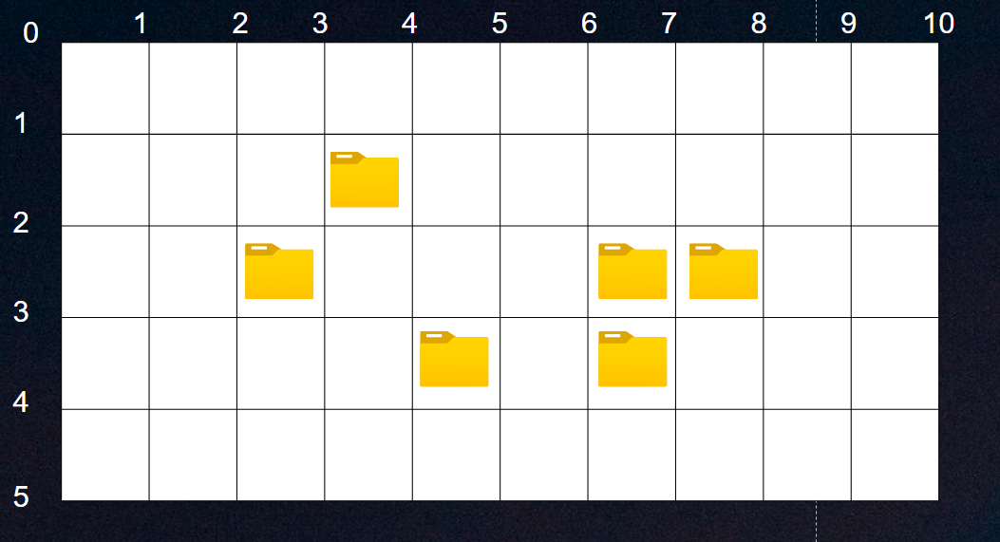

## 폴더  삭제
수뭉이는 게임을 하기 위해 컴퓨터를 켰다. 하지만 컴퓨터 바탕화면에 많은 폴더가 있어 게임 프로그램을 찾기가 쉽지 않다.

수뭉이는 이 참에 컴퓨터 바탕화면에 있는 폴더를 모두 삭제하고자 한다.

컴퓨터 바탕화면의 각 칸은 정사각형 격자판 형태이다. 바탕화면의 폴더들은 격자칸 안에 위치하고 격자점들은 화면 가장 왼쪽 위 (0, 0)에 시작해서 (세로, 가로) 좌표로 표현한다.

바탕 화면에서 폴더가 없는 빈칸은 $X$ , 폴더가 있는 칸은 $D$로 나타난다.

수뭉이는가장 크기가 작은드래그로 한 번에 모든 폴더를 선택해 삭제하고자 한다.

(이때 드래그의 시작점은왼쪽 상단이며 끝나는 점은 오른쪽 하단이다)

위 예시는 입력 1에 대한 그림이다. 최소의 드래그로 폴더를 삭제할 수 있는 방법은 $(1,2)$에서 시작하여 $(4,8)$까지 드래그 하는 것이다.
### 입력
첫 번째 줄에는 바탕화면의 행에 해당하는 $N$과 열에 해당하는 $M$이 $(1 \le N, M \le 50)$이 각각 공백을 사이로 주어진다.

두 번째 줄부터 $N+1$ 번째 줄까지 바탕화면의 상태가 주어진다.

### 출력
드래그 시작점 $(x1, y1)$과 끝점 $(x2, y2)$을 출력한다. (이는 $x1 < x2,  y1 < y2$를 만족해야 한다.)

만약 파일이 하나도 없는 경우 $0$을 출력한다.

### 예시 입력 1
5 10   
XXXXXXXXXX    
XXXXXDXXXX   
XXXXXXDDXX   
XXXDDXXXXX   
XXXXDXXXXX   

### 예시 출력 1
1 3 5 8

### 예시 입력 2
2 2   
XX   
XX   

### 예시 출력 2
0